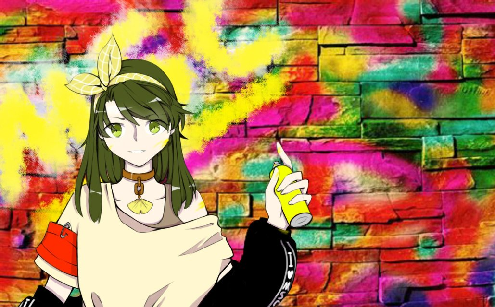

# RuanWeiwei! MSC-Idol-Project

## 介绍

MSC-Idol-Project 是微软学生俱乐部的看板娘**阮薇薇**同学（们）的出道计划，以及由此展开的多媒体企划。

## 欢迎语

阮薇薇的诞生，是一群 MSCer 为了以更亲和更大众的方式向外界宣传 MSC 而自发促成的 Project。
不同校的 MSC 的薇薇之间是姐妹关系，现在最年长的是来自四川大学的姐姐（19岁）。
薇薇彼此之间都相互认识，但都各自拥有着不同的故事和性格。

## 欢迎加入微软学生俱乐部

你不报 我不报

薇薇何时能出道

你不填 我不填

新人何时变部员

说好一起走花路

结果报名你都咕

说好一起进微软

结果潜水不复返

填了填不了吃亏

报了报不了上当

半小时泡不到小姐姐

半小时学不会C语言

走过路过不要错过

## 人设及更多内容

关于薇薇的具体人设请参考[薇薇人设详情](src/setup.md)